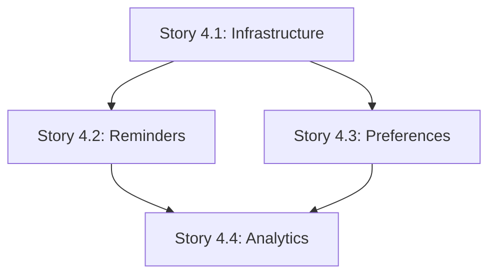

# Epic 7 - Email Management System

## 📧 Epic Overview

**Epic ID**: 7  
**Epic Name**: Email Management System  
**Epic Owner**: Product Owner  
**Status**: ✅ **APPROVED - IN PROGRESS**

### **Vision Statement**
Implementar um sistema completo de gerenciamento de emails automatizados que inclui reset de senha, lembretes de manutenção, preferências do usuário e analytics, proporcionando uma experiência profissional e engajante para os usuários.

---

## 🎯 Business Context

### **Problem Statement**
- Usuários não conseguem resetar senhas independentemente (dor crítica)
- Falta de lembretes automáticos resulta em baixo engajamento com manutenções
- Ausência de sistema profissional de emails prejudica a imagem da marca
- Sem controle de preferências, usuários podem considerar emails como spam

### **Business Value**
- **Support Reduction**: 40% menos tickets relacionados a senhas
- **User Engagement**: 35% aumento em atividade de manutenções
- **Professional Image**: Emails branded e responsivos
- **User Retention**: Melhor experiência e controle do usuário
- **Operational Excellence**: Monitoring e analytics para otimização

### **Success Metrics**
- 90%+ taxa de sucesso em password reset
- 35%+ email open rate
- 25%+ aumento em conclusão de manutenções
- 40% redução em tickets de suporte
- 99%+ email delivery rate

---

## 📋 Epic Breakdown

### **Stories Incluídas:**

#### **Story 4.1 - Email Infrastructure & Password Reset** ⭐ CRITICAL
- **File**: [4.1.email-infrastructure.md](./4.1.email-infrastructure.md)
- **Points**: 5 | **Sprint**: 1 | **Status**: Ready for Development
- **Scope**: Resend integration + Password reset flow completo
- **Value**: Resolve dor crítica dos usuários

#### **Story 4.2 - Maintenance Reminder System** 📅 HIGH
- **File**: [4.2.maintenance-reminders.md](./4.2.maintenance-reminders.md)
- **Points**: 5 | **Sprint**: 2 | **Status**: Ready for Planning
- **Scope**: Background jobs + maintenance reminders automáticos
- **Value**: 35% aumento em engagement

#### **Story 4.3 - Email Preferences & Management** ⚙️ MEDIUM
- **File**: [4.3.email-preferences.md](./4.3.email-preferences.md)
- **Points**: 3 | **Sprint**: 2 or 3 | **Status**: Ready for Planning
- **Scope**: User preferences + unsubscribe functionality
- **Value**: User control e compliance LGPD/GDPR

#### **Story 4.4 - Email Analytics & Monitoring** 📊 LOW
- **File**: [4.4.email-analytics.md](./4.4.email-analytics.md)
- **Points**: 3 | **Sprint**: 3 | **Status**: Ready for Planning
- **Scope**: Analytics dashboard + monitoring system
- **Value**: Operational excellence e business insights

---

## 🗓️ Implementation Timeline

### **Sprint 1 (Weeks 1-2)**
- **Focus**: Story 4.1 - Email Infrastructure & Password Reset
- **Deliverable**: Usuários podem resetar senha via email
- **Dependencies**: None
- **Risk**: Low

### **Sprint 2 (Weeks 3-4)** 
- **Focus**: Story 4.2 - Maintenance Reminder System
- **Deliverable**: Lembretes automáticos de manutenção funcionando
- **Dependencies**: Story 4.1 (email infrastructure)
- **Risk**: Medium (queue complexity)

### **Sprint 3 (Weeks 5-6) - Optional**
- **Focus**: Stories 4.3 + 4.4 - Preferences & Analytics
- **Deliverable**: Sistema completo com controles e monitoring
- **Dependencies**: Stories 4.1, 4.2
- **Risk**: Low

**Total Epic Duration**: 6 weeks (3 sprints)  
**Total Epic Points**: 16 story points

---

## 🔧 Technical Architecture

### **Core Technology Stack**
- **Email Provider**: Resend (modern, developer-friendly)
- **Template Engine**: React Email (JSX-based templates)
- **Queue System**: Bull + Redis (background job processing)
- **Database**: PostgreSQL (extended schemas)
- **Frontend**: Next.js + TypeScript (settings pages)

### **Key Infrastructure Components**

#### **1. Email Service Layer**
```typescript
EmailService {
  - sendPasswordReset()
  - sendMaintenanceReminder()
  - sendWelcomeEmail()
  - checkUserPreferences()
}
```

#### **2. Background Queue System**
```typescript
EmailQueue {
  - addPasswordResetJob()
  - addMaintenanceReminderJob()
  - processEmailJobs()
  - retryFailedJobs()
}
```

#### **3. User Preference Management**
```typescript
EmailPreferenceService {
  - getUserPreferences()
  - updateUserPreferences()
  - canSendEmail()
  - handleUnsubscribe()
}
```

#### **4. Analytics & Monitoring**
```typescript
EmailAnalyticsService {
  - trackEmailEvents()
  - generateReports()
  - checkAlertConditions()
  - getDashboardMetrics()
}
```

### **Database Schema Extensions**
- `password_reset_tokens` - Token management for password reset
- `user_email_preferences` - User email preferences and unsubscribe
- `email_logs` - Audit trail and tracking of sent emails
- `email_analytics_daily` - Aggregated metrics for dashboard

---

## 📊 Epic Dependencies

### **External Dependencies**
- **Resend Account**: Setup and domain verification required
- **Redis Infrastructure**: For background job queue
- **Email Templates**: Professional design and testing
- **Frontend Routes**: Settings pages and reset flows

### **Internal Dependencies**
- **User Authentication**: Required for all email operations
- **Scheduled Maintenance**: Data source for reminders
- **Admin Interface**: For analytics and monitoring access

### **Dependency Chain**


---

## 🧪 Epic Testing Strategy

### **Testing Approach by Story**

#### **Story 4.1 Testing**
- Unit tests for password reset logic
- Integration tests for Resend API
- E2E tests for complete reset flow
- Email template rendering tests

#### **Story 4.2 Testing**
- Queue job processing tests
- Cron job scheduling tests
- Email reminder content tests
- Background job failure handling

#### **Story 4.3 Testing**
- User preference API tests
- Frontend settings page tests
- Unsubscribe flow testing
- LGPD/GDPR compliance validation

#### **Story 4.4 Testing**
- Analytics calculation accuracy
- Dashboard performance tests
- Webhook event processing
- Alert system functionality

### **Epic-Level Testing**
- **Integration Testing**: All email systems working together
- **Performance Testing**: High volume email processing
- **Security Testing**: Email content and token security
- **Compliance Testing**: LGPD/GDPR requirements

---

## 🚨 Epic Risks & Mitigation

### **High Priority Risks**

#### **1. Email Deliverability**
- **Risk**: Emails going to spam or not being delivered
- **Mitigation**: Proper domain setup, SPF/DKIM records, Resend reputation
- **Owner**: DevOps + Development Team

#### **2. Queue System Reliability**
- **Risk**: Background jobs failing or getting stuck
- **Mitigation**: Comprehensive retry logic, monitoring, dead letter queue
- **Owner**: Development Team

#### **3. User Experience**
- **Risk**: Poor email templates or confusing flows
- **Mitigation**: User testing, professional templates, clear messaging
- **Owner**: Product Owner + QA Team

### **Medium Priority Risks**

#### **4. Performance at Scale**
- **Risk**: System slowing down with large email volumes
- **Mitigation**: Queue optimization, database indexing, caching
- **Owner**: Development Team + DevOps

#### **5. Compliance Requirements**
- **Risk**: LGPD/GDPR non-compliance
- **Mitigation**: Proper unsubscribe flows, data retention policies
- **Owner**: Product Owner + Legal Team

---

## 📈 Epic Success Criteria

### **Functional Requirements**
- [ ] All 4 stories completed successfully
- [ ] Password reset flow working end-to-end
- [ ] Maintenance reminders sent automatically
- [ ] User email preferences fully manageable
- [ ] Analytics dashboard operational

### **Quality Requirements**
- [ ] 95%+ test coverage across all stories
- [ ] 99%+ email delivery rate
- [ ] < 2s average email processing time
- [ ] Zero security vulnerabilities
- [ ] LGPD/GDPR compliance validated

### **Business Requirements**
- [ ] 40% reduction in password reset support tickets
- [ ] 35% increase in maintenance completion rate
- [ ] 90%+ user satisfaction with email communications
- [ ] < 5% email unsubscribe rate
- [ ] Professional brand image maintained

---

## 📋 Epic Definition of Done

### **Technical DoD**
- [ ] All stories meet their individual Definition of Done
- [ ] End-to-end email system integration tested
- [ ] Performance benchmarks met
- [ ] Security review completed
- [ ] Documentation updated (API docs, user guides, admin guides)

### **Business DoD**
- [ ] Product Owner acceptance of all stories
- [ ] User acceptance testing completed
- [ ] Success metrics baseline established
- [ ] Support team trained on new email system
- [ ] Go-live plan executed successfully

### **Operational DoD**
- [ ] Monitoring and alerting configured
- [ ] Backup and recovery procedures documented
- [ ] Performance optimization completed
- [ ] Analytics dashboard live and accessible
- [ ] Support runbooks created

---

## 📅 Epic Timeline & Milestones

### **Milestone 1: Foundation Complete** (End of Sprint 1)
- ✅ Email infrastructure setup
- ✅ Password reset fully functional
- ✅ Basic email logging in place
- **Success Criteria**: Users can reset passwords via email

### **Milestone 2: Core Functionality Complete** (End of Sprint 2)  
- ✅ Maintenance reminders operational
- ✅ Background job system stable
- ✅ User preferences manageable
- **Success Criteria**: Automated emails improving user engagement

### **Milestone 3: Epic Complete** (End of Sprint 3)
- ✅ Analytics dashboard live
- ✅ Full monitoring in place
- ✅ System optimized and stable
- **Success Criteria**: Complete email management system operational

---

## 🎯 Epic Retrospective Planning

### **Key Questions for Retrospective**
1. How effective was the epic breakdown into smaller stories?
2. Were the dependencies between stories well-managed?
3. Did the email system meet business expectations?
4. What would we do differently in the next email-related epic?
5. How can we improve our email template development process?

### **Epic Learnings to Capture**
- Email provider integration best practices
- Background job queue optimization techniques
- User preference management patterns
- Email analytics and monitoring strategies
- Compliance and security considerations

---

## 📚 Epic Documentation

### **Technical Documentation**
- [Email Service Architecture](../technical/email-service-architecture.md)
- [Resend Integration Guide](../technical/resend-integration.md)
- [Email Queue Management](../technical/email-queue-management.md)
- [Email Template Development](../technical/email-template-development.md)

### **User Documentation**
- [Password Reset User Guide](../user/password-reset-guide.md)
- [Email Preferences Management](../user/email-preferences-guide.md)
- [Email Troubleshooting](../user/email-troubleshooting.md)

### **Admin Documentation**
- [Email Analytics Dashboard](../admin/email-analytics-guide.md)
- [Email System Monitoring](../admin/email-monitoring-guide.md)
- [Email System Administration](../admin/email-admin-guide.md)

---

**Epic Created**: 2025-01-27  
**Last Updated**: 2025-01-27  
**Epic Owner**: Product Owner  
**Epic Status**: ✅ APPROVED - IN PROGRESS  
**Next Review**: End of Sprint 1